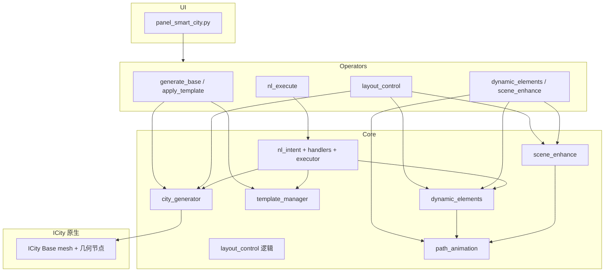

# ICity + Smart City Generator — 项目架构与模块说明

> **版本**：与插件 `bl_info` 1.0.4 对齐（Blender 4.1）  
> **面板位置**：3D 视口 → 侧边栏 **ICity** 选项卡 → **Smart City Generator**  
> **本文目标**：帮助团队理解代码框架、各 Panel 区域与源码的对应关系及协作方式。
>
> **团队成员**：王旭  朱晨瑞  吴红祥  吴行健  周昊川  岳科言  谭易
>
> **注**：我在将该项目插件上传至Github时，没有上传icity文件夹中根目录下(同README.md目录位置)的assets文件夹，即资源文件夹，因为这个文件夹内存过大(1.50GB)，因此没有上传。完整assets资源以及演示视频可以前往下面的这个百度网盘链接进行下载：
>
> 
>
> 通过网盘分享的文件：Icity插件(软件工程课程大作业开发)
> 链接: https://pan.baidu.com/s/1l7wHcXwEfBTEeLvWO_XZBg?pwd=APTX 提取码: APTX

---

## 1. 项目是什么

本仓库是一个 **Blender 插件**，由两部分组成：

| 部分 | 说明 |
|------|------|
| **ICity 原生** | 单文件主体 `__init__.py`（约 3500+ 行）：程序化城市、几何节点、Road 2、ICity editor 面板 |
| **Smart City Generator（SCG）** | 团队在 ICity 之上的扩展：独立 Panel、Operator、`core/` 业务逻辑，**不修改** ICity 原生类定义 |

用户只需启用 **一个插件**（`ICity + Smart City Generator`），在 **ICity 侧边栏** 内同时使用原生编辑与 SCG 团队功能。

---

## 2. 整体架构

```
┌─────────────────────────────────────────────────────────────────┐
│  Blender  UI  (VIEW_3D → ICity 选项卡)                          │
│  ┌──────────────────────┐  ┌──────────────────────────────────┐│
│  │ ICity editor (原生)   │  │ Smart City Generator (SCG 团队)   ││
│  │ Start / Edit / 资产   │  │ 区域 1～7 + 场景状态 + ICity 桥接 ││
│  └──────────┬───────────┘  └───────────────┬──────────────────┘│
└─────────────┼──────────────────────────────┼────────────────────┘
              │                              │
              ▼                              ▼
┌─────────────────────────┐    ┌──────────────────────────────────┐
│ icity/__init__.py       │    │ scg_register.py                  │
│ SNA_OT_Start / Edit …   │◄───│ 注册 properties / operators / UI │
│ ICity Base / 几何节点    │    │ register_default_commands()      │
└─────────────────────────┘    └───────────────┬──────────────────┘
                                               │
              ┌────────────────────────────────┼────────────────────┐
              ▼                                ▼                    ▼
     operators/*.py                      core/*.py           ui/panel_smart_city.py
     (按钮 → execute)                   (业务逻辑)            (绘制 Panel)
              │                                │
              └────────────────┬───────────────┘
                               ▼
                    Scene 属性 (scg_properties.py)
                    config/templates.json
                    assets/ 外部 .blend 与贴图
```

**典型调用链**（以区域 7 自然语言为例）：

```
Panel 输入 + 执行指令
  → operators/nl_execute.py  (scg.execute_nl)
  → core/nl_intent_engine.py (离线规则 / LLM)
  → core/command_executor.py (分发 commands)
  → core/nl_handlers.py      (写 Attribute / 调 bpy.ops / 生成城市)
  → core/city_generator.py 等 (与 ICity 网格交互)
```

---

## 3. 目录结构与职责

```
icity/
├── __init__.py              # ICity 原生插件主体 + 末尾调用 scg_register
├── scg_register.py          # SCG 统一注册入口
├── scg_properties.py        # Scene 上全部 scg_* 自定义属性
├── scg_nl_preferences.py    # NL LLM API 配置 + 本地 JSON 持久化
│
├── config/
│   └── templates.json       # 模板 0/1 静态表（树/路/椅/密度/昼夜）
│
├── assets/                  # 团队资产（cars、people、lake、boat、manual_paths…）
│
├── core/                    # 业务逻辑（无 UI）
│   ├── city_generator.py    # 生成/恢复城市、写 ICity Base Attribute、与 ICity 桥接
│   ├── template_manager.py  # 读 templates.json、应用模板、昼夜环境
│   ├── assets_manager.py    # 资产路径、贴图/模型可用性检测
│   ├── street_lights.py     # 路灯 append 与放置
│   ├── scene_enhance.py     # 中央山水（lake）
│   ├── dynamic_elements.py  # 车辆/行人/船只
│   ├── path_animation.py    # 道路环路、手动画路径、切线关键帧动画
│   ├── command_executor.py  # NL commands JSON 分发
│   ├── nl_handlers.py       # 各 action 实现
│   ├── nl_intent_engine.py  # 离线解析 + LLM 入口
│   └── nl_llm_backend.py    # DeepSeek 等 OpenAI 兼容 API
│
├── operators/               # Blender Operator（Panel 按钮）
│   ├── icity_bridge.py      # scg.start_icity / scg.edit_city
│   ├── generate_base.py
│   ├── road_texture.py
│   ├── street_lights.py
│   ├── apply_template.py
│   ├── layout_control.py    # 布局点线 + 草图提取（体量最大）
│   ├── scene_enhance.py
│   ├── dynamic_elements.py
│   └── nl_execute.py
│
├── ui/
│   └── panel_smart_city.py  # Smart City Generator 面板（区域 1～8）
│
├── docs/                    # 技术说明与测试脚本
└── 团队作业/                 # 流程、验收、Day 文档
```

**设计原则**（见 `ui/panel_smart_city.py` 头部注释）：

- SCG **独立 Panel**，`bl_category='ICity'`，`bl_order=5`
- **未 Start ICity** 时只显示 Start；`icity_scene_ready()` 为真后才解锁区域 1～7
- City·Road 细编辑仍在 **ICity editor**，不在 SCG Panel 重复

---

## 4. 注册与 Scene 属性

### 4.1 注册顺序（`scg_register.register()`）

1. `register_default_commands()` — 注册 NL action handler 表  
2. `scg_nl_preferences.register()` — LLM 配置（Scene 字段，无侵入 ICity Preferences）  
3. `scg_properties.register()` — 全部 `scg_*` Scene 属性  
4. `operators.register()` — 所有 `scg.*` Operator  
5. `ui.register()` — `SCG_PT_smart_city_generator` Panel  

### 4.2 关键 Scene 属性（`scg_properties.py`）

| 属性前缀 | 用途 |
|----------|------|
| `scg_city_scale` / `scg_building_*` / `scg_*_type` | 区域 1 生成参数 |
| `scg_template_id` | 区域 4 模板编号 |
| `scg_layout_*` | 区域 5 点线 JSON、草图、状态 |
| `scg_car_*` / `scg_pedestrian_*` / `scg_boat_*` | 区域 6 动态元素 |
| `scg_nl_*` / `scg_use_llm` | 区域 7 自然语言 |
| `scg_street_light_night` | 区域 3 路灯夜间发光 |

---

## 5. Panel 分模块说明（区域 1～7）

以下各节结构：**面板做什么 → Operator → core 逻辑 → 文件配合**。

---

### 区域 0（前置）：场景状态 + ICity 基础

| UI | Operator | 核心逻辑 |
|----|----------|----------|
| Start | `scg.start_icity` | 转发 `bpy.ops.sna.start_*`（ICity 原生） |
| Edit City | `scg.edit_city` | `city_generator.enter_icity_edit_mode()` |

**就绪判断**：`core/city_generator.py` 中 `icity_scene_ready()` — 需存在 ICity 集合并有 **ICity Base** 网格。

**文件**：`operators/icity_bridge.py` · `ui/panel_smart_city.py`（L76–110）

---

### 区域 1 · 基础场景生成

**作用**：按面板枚举写入 **ICity Base** 的面 Attribute（规模、密度、树/路/椅类型等），触发程序化建筑/道路/街道资产刷新，**不依赖模板 JSON**。

| 面板控件 | Scene 属性 | Operator |
|----------|------------|----------|
| 城市规模 / 密度 / 样式 | `scg_city_scale`, `scg_building_density`, `scg_building_type` | — |
| 道路 / 树 / 椅类型 | `scg_road_type`, `scg_tree_type`, `scg_bench_type` | — |
| 生成后进入编辑 | `scg_enter_edit_after_generate` | — |
| **生成基础城市** | — | `scg.generate_base_city` |

**实现逻辑**：

1. `operators/generate_base.py` → `generate_base_city_from_scene(scene, context)`  
2. `core/city_generator.py`：读取 Scene 属性 → 写 mesh Attribute（`space type`、`Procedural index`、道路宽度等）→ 调用 ICity 刷新逻辑（Road apply、建筑实例化等）  
3. 可选：`enter_icity_edit_mode()` 进入 ICity 编辑模式  

**与 ICity 关系**：复用 ICity 几何节点与 Attribute 约定；SCG 负责 **Object 模式下的一键参数化生成**（团队 Day 2–3 验收 **A2**）。

**文件**：`operators/generate_base.py` · `core/city_generator.py` · `scg_properties.py` · `ui/panel_smart_city.py`（L112–136）

---

### 区域 2 · 道路纹理

**作用**：切换 **2D 道路 PBR 贴图**（类型 1 / 2），更新 `Road 2` 材质，**不必整城重建**。

| 面板 | Operator |
|------|----------|
| 道路类型（与区域 1 共用 `scg_road_type`） | — |
| **应用道路纹理** | `scg.apply_road_texture` |

**实现逻辑**：

1. `operators/road_texture.py` → `city_generator.set_road_texture()` / 材质刷新  
2. `core/assets_manager.py`：贴图路径、`road_texture_available()`、`road_texture_label()`  
3. Panel 显示资产是否缺失（**A3** 验收）

**文件**：`operators/road_texture.py` · `core/city_generator.py` · `core/assets_manager.py` · `ui/panel_smart_city.py`（L138–161）

---

### 区域 3 · 路灯（3D 资产）

**作用**：沿道路 append **Street_Lamp.blend**，写入路灯 Object 引用（与 ICity 街道资产机制一致）。

| 面板 | Operator |
|------|----------|
| 夜间 Emission | `scg_street_light_night` |
| **添加路灯** | `scg.apply_street_lights` |

**实现逻辑**：

1. `operators/street_lights.py` → `core/street_lights.py`  
2. 检测 `assets/team/models/lamp/Street_Lamp.blend`，append 并挂到场景  

**文件**：`operators/street_lights.py` · `core/street_lights.py` · `ui/panel_smart_city.py`（L163–177）  
**验收**：**A4**

---

### 区域 4 · 模版选择

**作用**：读取 **`config/templates.json`**，一键设置树/路/椅/密度/昼夜并 **生成城市**（比区域 1 多环境切换）。

| 面板 | 配置 | Operator |
|------|------|----------|
| 模板编号 | `scg_template_id` | — |
| 说明行 | `core/template_manager.get_template()` | — |
| **应用模板** | — | `scg.apply_template` |

**实现逻辑**：

1. `operators/apply_template.py` → `template_manager.apply_template()`  
2. 写 Scene 属性 → `set_environment(day/night)` → 调用 `generate_base_city_from_scene()`  
3. NL/LLM 也可通过 `apply_template` action 走同一后端（区域 7）

**文件**：`operators/apply_template.py` · `core/template_manager.py` · `config/templates.json` · `ui/panel_smart_city.py`（L179–198）  
**验收**：**A5**（模板 0 / 1）

---

### 区域 5 · 布局控制

**作用**：用 **点集 + 边集**（JSON）或 **草图图像** 重建 `ICity Base` 道路拓扑（BMesh），实现自定义街区形状（**A9**）。

| 功能 | Operator |
|------|----------|
| 载入示例（单块矩形 432×334） | `scg.fill_layout_demo` |
| 应用布局 | `scg.apply_layout` |
| 恢复基础城市 | `scg.restore_base_city` |
| 草图提取 / 提取并应用 | `scg.extract_layout_from_image` |

**实现逻辑（`operators/layout_control.py`，约 1500+ 行）**：

1. **解析**：`_parse_literal()` 读 `scg_layout_points_json` / `scg_layout_edges_json`  
2. **应用**：`restore_icity_base_mesh()` → BMesh 清空重建顶点/边/面 → 写面/边 Attribute → 道路纹理 + Road 2 + 建筑刷新  
3. **草图**：二值化 → Zhang-Suen 细化 → 图规整 → 输出 JSON（可游标居中）  
4. **联动**：若已有山水/车人，`_sync_dependent_scene_objects_after_layout()` 自动 cleanup + 重建  

**配合文件**：

- `scg_properties.py` — `scg_layout_*`  
- `core/city_generator.py` — `restore_icity_base_mesh`, `restore_base_city_from_scene`  
- `core/scene_enhance.py` / `core/dynamic_elements.py` — 布局后重建生态与动态元素  

**文件**：`operators/layout_control.py` · `ui/panel_smart_city.py`（L200–231）  
**详细文档**：`团队作业/Day 12-13/布局控制进度对照.md`

---

### 区域 6 · 场景增强（生态）

**作用**：中央 **山水** + **车辆/行人/船只** 路径动画 + **手动画路径库**（**A7 / A8**）。

#### 6.1 山水

| 面板 | Operator | Core |
|------|----------|------|
| 添加中央山水 | `scg.add_landscape_surround` | `scene_enhance.add_landscape_surround()` |
| 清除山水环境 | `scg.remove_landscape_surround` | `cleanup_landscape_surround()` |

- 从 `lake/LowPolyTrees.blend` append，按城市包围盒 **缩放并对齐**，城市位于水面中央  
- `_purge_orphan_lake_meshes()` 清除游标处残留缩小网格  

#### 6.2 动态元素

| 面板 | Operator | Core |
|------|----------|------|
| 车辆型号 / 数量 | `scg_car_model`, `scg_car_count` | — |
| 行人数量 | `scg_pedestrian_count` | — |
| **添加车辆与行人** | `scg.add_dynamic_elements` | `dynamic_elements.add_cars_and_pedestrians()` |
| 船只数量 | `scg_boat_count` | — |
| **添加船只** | `scg.add_boats` | `dynamic_elements.add_boats()` |
| **保存曲线到路径库** | `scg.export_manual_paths` | `path_animation.export_manual_paths_to_library()` |
| 动画结束帧 | `scg_animation_frame_end` | `path_animation.get_animation_frame_range()` |

**动画管线**（三文件协作）：

```
dynamic_elements.py          path_animation.py              scene_enhance.py
      │                              │                              │
      ├─ append 车/人/船资产            ├─ extract_street_loop()       ├─ get_water_surface_z()
      ├─ 优先 manual_paths.blend      ├─ create_lane_loop_curve()    ├─ 避城心/外岸采样
      └─ add_follow_path_animation() ─► add_curve_location_animation()  (船只贴水面)
```

- 车辆：**双向靠右**、`reverse_path=True`、切线关键帧（非 Follow Path 侧滑）  
- 船只：`_move_rig_to_collection()` 防止取消选中后消失；`scg_boat_float_z` 吃水线  

**文件**：`operators/scene_enhance.py` · `operators/dynamic_elements.py` · `core/scene_enhance.py` · `core/dynamic_elements.py` · `core/path_animation.py` · `docs/manual_path_curves.md` · `ui/panel_smart_city.py`（L233–289）

---

### 区域 7 · 自然语言

**作用**：中文指令 → **commands JSON** → 执行与区域 1～6 相同的后端（**A6**：≥5 条稳定；**P2**：DeepSeek LLM + 离线兜底）。

| 面板 | Operator / 属性 |
|------|-----------------|
| LLM 开关 | `scg_use_llm` |
| API 配置 | `scg_nl_*` + `scg.save_nl_api_settings` |
| 指令输入 | `scg_nl_input_text` |
| **执行指令** | `scg.execute_nl` |
| 状态 / 解析来源 | `scg_nl_status`, `scg_nl_last_source` |

**双模式解析**：

```
scg_nl_input_text
       │
       ▼
nl_intent_engine.parse_nl_input(use_llm?)
   ├─ True  → nl_llm_backend.call_llm_and_to_payload()  (DeepSeek)
   └─ 失败/False → offline_parse() 正则规则
       │
       ▼
command_executor.execute_commands()
       │
       ▼
nl_handlers  (apply_template / set_environment / add_dynamic_element …)
```

**已注册 action**（见 `团队作业/插件命令协议.md`）：

| action | 对应后端 |
|--------|----------|
| `apply_template` | `template_manager` |
| `apply_asset_config` | 写 scg_* + 可选重新生成 |
| `set_road_texture` | 同区域 2 |
| `set_environment` | 昼夜 / 雨天（方案 A） |
| `add_dynamic_element` | 同区域 6（car 仅车） |
| `add_street_lights` | 同区域 3 |

**文件**：`operators/nl_execute.py` · `core/nl_intent_engine.py` · `core/nl_llm_backend.py` · `core/command_executor.py` · `core/nl_handlers.py` · `scg_nl_preferences.py` · `ui/panel_smart_city.py`（L291–329）  
**详细文档**：`docs/nl_llm_overview.md` · `团队作业/插件命令协议.md`

---

### 区域 8 · 渲染输出（占位）

当前为阶段五占位文案；**实际渲染**按手动流程：`团队作业/Day 20-21/手动渲染操作指南.md`（Cycles/EEVEE、相机、F12 / Ctrl+F12）。

**占位 Operator**：`operators/render_output.py`（未接入 Panel 按钮）。

---

## 6. 模块间依赖关系（简图）



---

## 7. 配置、资产与测试

| 类型 | 路径 | 说明 |
|------|------|------|
| 模板表 | `config/templates.json` | 静态，LLM 不修改文件 |
| 命令协议 | `团队作业/插件命令协议.md` | NL/LLM JSON 格式 |
| 手动画路径 | `assets/manual_paths/manual_paths.blend` | `SCG_Manual_Car_*` / `Boat` 等 |
| 车辆 | `assets/team/models/cars/source/*.blend` | 面板 `scg_car_model` 动态枚举 |
| 行人 | `assets/team/models/people/people.blend` | |
| 山水 | `assets/team/models/lake/.../LowPolyTrees.blend` | |
| 船只 | `assets/team/models/boat/boat_model_scarit.blend` | |
| 路灯 | `assets/team/models/lamp/Street_Lamp.blend` | |

**测试脚本**（`docs/`）：

| 脚本 | 用途 |
|------|------|
| `nl_p0_manual_test.py` | 直接测 command_executor |
| `nl_p1_offline_test.py` / `nl_p1_manual_test.py` | 离线 NL |
| `nl_p2_llm_test.py` | LLM 联调 |

---

## 8. 验收项与 Panel 对应

| 编号 | 内容 | 主要 Panel 区域 |
|------|------|-----------------|
| A1 | 插件安装 / Start | 场景状态 |
| A2 | 基础生成 | 1 |
| A3 | 2D 道路纹理 | 2 |
| A4 | 3D 路灯 | 3 |
| A5 | 模板 0/1 | 4 |
| A6 | NL ≥5 条 | 7 |
| A7 | 动态元素 | 6 |
| A8 | 生态山水/船 | 6 |
| A9 | 布局点线 | 5 |
| A10 | 渲染成片 | 手动渲染（见 Day 20–21 文档） |

---

## 9. 延伸阅读（团队文档）

| 文档 | 内容 |
|------|------|
| [`README.md`](README.md) | 插件安装与快速上手 |
| [`icity简述.md`](icity简述.md) | ICity 原生机制 |
| [`团队作业/待办工作流程及时间线.md`](团队作业/待办工作流程及时间线.md) | 阶段与里程碑 |
| [`团队作业/插件目录结构规划.md`](团队作业/插件目录结构规划.md) | 目录规划 |
| [`团队作业/Day 2/Panel设计说明.md`](团队作业/Day%202/Panel设计说明.md) | Panel 早期设计 |
| [`docs/nl_llm_overview.md`](docs/nl_llm_overview.md) | 自然语言 / LLM |
| [`团队作业/Day 12-13/布局控制进度对照.md`](团队作业/Day%2012-13/布局控制进度对照.md) | 布局 |
| [`团队作业/Day 12-13/动态元素整合记录.md`](团队作业/Day%2012-13/动态元素整合记录.md) | 动态/山水合并记录 |

---

## 10. 给新成员的上手顺序

1. 启用插件 → **Start** → 熟悉 ICity editor 与 SCG Panel 分工  
2. **区域 1** 生成基础城市 → **区域 2～4** 纹理 / 路灯 / 模板  
3. **区域 6** 车人与山水 → **区域 7** NL 五条 → **区域 5** 布局 
4. 阅读 `core/city_generator.py` 理解 Attribute 写入  
5. 需要改 NL 时读 `插件命令协议.md` + `nl_handlers.py`  
6. 需要改动画时读 `path_animation.py` + `manual_path_curves.md`  

---

*文档维护：团队作业 Icity下的 SCG 组；与代码不一致时以源码为准。*

